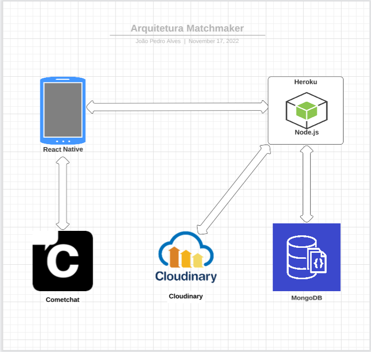
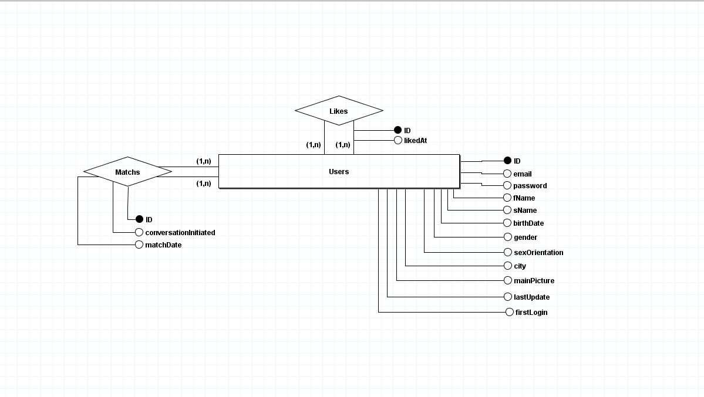

# Representação da Arquitetura

## Modelo de Arquitetura

### Fluxos
- Usuario interage com React Native.
- Ação do Usuário causa uma chamada para a API do Node ou do Cometchat.
- Caso a chamada tenho sido para a API do Cometchat, ela ira receber as mensagens que estão armazenadas para o usuário e seus Matchs.
- Caso chamada tenha sido para API Node, ela identifica o pedido e processa oque foi requisitado.
- Caso a API Node precise armazenar uma foto ela irá se comunicar com o Cloudinary.
- Caso a API Node precise buscar, alterar ou excluir dados da base de dados ela irá se comunicar com o MongoDB.

## Visão Lógica

### Banco de Dados

